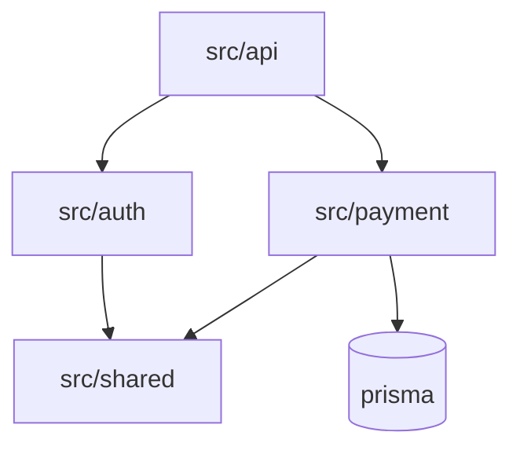

# Kairo

> Persistent engineering memory and session-continuity for AI coding agents.
> Local-first. Deterministic. Replay-safe.

[](https://github.com/sandy001-kki/Kairo/releases)
[](tests)
[](docs/adr)
[](docs/API_STABILITY.md)
[](docs/API_STABILITY.md)
[](package.json)
[](tsconfig.json)
[](docs/ARCHITECTURE.md)
[](docs/adr/0001-event-sourced-storage.md)
[](LICENSE)

Kairo sits between AI coding agents — Claude Code, Cursor, Codex, Gemini CLI —
and your repository. It is the layer that _remembers_: a senior engineer's
notebook the agent reads at the start of every session and writes to throughout.

It does not run agents. It does not call a model. It runs **next to** the
agent, on your machine, and gives it the durable memory a model cannot keep
on its own.

```
your repo ──▶ AI agent ──▶ Kairo (MCP) ──▶ .kairo/ on local disk
                  ▲                          │
                  └──── continuation brief ◀─┘
                       (resume, don't rescan)
```

---

## 10-second pitch

AI coding agents forget. Kairo remembers — durably, deterministically, locally.

## 1-minute pitch

Every new agent session starts by re-deriving the repo: which files exist,
which framework, what the entry points are. That's wasteful, slow, and
context-window-hostile. Mid-task the agent runs out of context and stops
without a clean handoff. The next agent starts from zero.

Kairo records what happens during a session (file changes, decisions, errors,
risk assessments), writes durable checkpoints, and hands the next session an
exact continuation brief — _"here's what was being done, here's where it
stopped, here are the files to look at first"_. Same project, next agent,
no rescan.

## 5-minute pitch — how it works

| Layer                   | What it does                                                   | Where it lives                        |
| ----------------------- | -------------------------------------------------------------- | ------------------------------------- |
| **MCP server**          | 41 tools the agent calls during work.                          | stdio, launched by your MCP host.     |
| **Session ledger**      | Append-only log of events, decisions, errors.                  | `.kairo/events.jsonl`                 |
| **Checkpoints**         | Durable, sanitized, resumable snapshots.                       | `.kairo/checkpoints/*.json`           |
| **Continuation briefs** | Markdown handoffs in three size modes.                         | `.kairo/continuations/*.md`           |
| **Repo intelligence**   | Cached fingerprint + framework/language/entry-point detection. | `.kairo/intelligence/latest.json`     |
| **Vector memory**       | Architecture-aware hybrid recall (deterministic by default).   | `.kairo/vector/index.json`            |
| **Graphs**              | Mermaid module / service / architecture diagrams.              | `.kairo/graphs/*.md`                  |
| **Inspect surfaces**    | Read-only HTTP + VS Code views.                                | `kairo inspect`, `extensions/vscode/` |

Every persisted artefact carries a schema version. Reads validate at the
storage seam; corrupt lines go to `.kairo/quarantine/`; migrations are pure
functions. The full architecture sits in
[`docs/ARCHITECTURE.md`](docs/ARCHITECTURE.md).

---

## Why AI coding breaks at scale (the honest version)

| Failure mode                            | Why it happens                                | What Kairo does about it                                                            |
| --------------------------------------- | --------------------------------------------- | ----------------------------------------------------------------------------------- |
| **Rescan every session**                | Agents have no durable scratch space.         | `kairo_session_start` returns cached `RepoIntelligence` + prior continuation brief. |
| **Hit context window mid-task**         | Long sessions exceed any model's window.      | Pressure model + `CHECKPOINT_NOW` directive → safe handoff before crash.            |
| **Repeat past mistakes**                | Agents don't remember last week's decisions.  | Decisions, errors, risk assessments persisted to event log.                         |
| **Lose architectural understanding**    | Agent re-derives layout from scratch.         | Pre-computed module + service + architecture graphs available on read.              |
| **No-context handoff between agents**   | Switching from Claude to Cursor = start over. | Continuation brief works for any MCP-speaking agent.                                |
| **Cross-worker conflicts**              | Two devs/agents touching the same module.     | Cooperative file leases (`kairo_lease`) — explainable, no consensus needed.         |
| **Token cost of "remember everything"** | Naive memory layers bloat every prompt.       | Brief modes: `tiny` (1500 chars), `normal` (4000), `deep` (20000).                  |

Kairo is **cooperative**, not omniscient. It cannot force an agent to stop.
It makes losing context expensive and safe handoff cheap. That is achievable
and genuinely valuable — and we would rather document the limit than oversell.

---

## What Kairo is NOT

Five boundaries on the front page so they aren't buried in an ADR:

1. **Not distributed consensus.** Coordination is cooperative-on-shared-storage
   (file leases over `.kairo/`), not Paxos/Raft.
2. **Not SaaS.** No accounts, no hosted backend, no remote telemetry. `.kairo/`
   lives on the local filesystem.
3. **Not autonomous AGI orchestration.** Kairo is memory + continuity. The
   agent decides; Kairo records and advises.
4. **Not guaranteed semantic truth.** Vector recall is hybrid + salience-ranked;
   the deterministic default is honestly lexical/structural.
5. **Not real-time collaborative editing.** No streams, no push, no live
   cursors. Historical inspection + cooperative coordination.

Out of scope **by design**, not deferred.

---

## Quick start (60 seconds)

In any project:

```bash
# 1. Install
npm install github:sandy001-kki/Kairo#v1.1.0

# 2. Wire it into your MCP host (Claude Code, Cursor, etc.)
npx kairo init

# 3. Verify
npx kairo doctor
```

You should see:

```
Doctor
  ok  project root           /your/project
  ok  kairo-mcp installed    ./node_modules/kairo-mcp/dist/index.js
  ok  .mcp.json wires kairo  ./.mcp.json
  !!  .kairo/ present        (none yet — first MCP session creates it)
  ok  quarantine empty       clean
  ok  version match          installed=1.1.0 cli=1.1.0

next: 1 check(s) need attention.
```

(The `.kairo/` warning is expected — the first agent session creates it.)

Open Claude Code in the project, run `/mcp`, you'll see `kairo · connected`.
Then say _"start a Kairo session and help me with X."_

---

## Real workflow

```bash
$ cd flexdee-monorepo
$ npx kairo init
Initialised
  .mcp.json:   written
  .gitignore:  appended

next: open Claude Code in this project, then run /mcp — kairo should be connected.

# ── Day 1: open Claude Code, work for an hour, end the session ────────
$ npx kairo status
Project
  root              S:\projects\flexdee-monorepo
  events            47
  telemetry         12
  sessions          1
  checkpoints       2
  quarantine        0
  latest session    01JD8VK7HQM…
  latest checkpoint 01JD8WPCXNE…

Intelligence
  schema     v4
  files      842
  frameworks express, nextjs, prisma
  languages  TypeScript, JavaScript, SQL

# ── Day 2: see exactly what the next agent will resume from ───────────
$ npx kairo brief --tiny
# Kairo Continuation Brief (tiny)

- **Task:** wire idempotent payment retries
- **Stop point:** session-end · risk HIGH · pressure CONTINUE
- **Files changed:** 3 — top: src/payment/charge.ts, src/payment/retry.ts
- **Next:**
  1. Resolve the 1 unresolved error(s) before new feature work.
  1. Re-validate high-risk changes before proceeding: src/payment/charge.ts.
- **Critical warnings:**
  - ⚠️ integration test flakes on retry path

# ── Inspect everything in your browser ────────────────────────────────
$ npx kairo inspect
ready http://127.0.0.1:4173
  project: S:\projects\flexdee-monorepo
  read-only · no network · Ctrl+C to stop
```

---

## Token reduction example

Same checkpoint, three modes — measured on Kairo's own repo:

| Mode               | Chars | % of `deep` | Use when                           |
| ------------------ | ----: | ----------: | ---------------------------------- |
| `tiny`             |   632 |         15% | Pre-empt rescans on cheap startup. |
| `normal` (default) | 2,946 |         71% | Resumes / checkpoints.             |
| `deep`             | 4,146 |        100% | Explicit historical review.        |

```bash
$ npx kairo brief --tiny    # 632 chars
$ npx kairo brief           # 2946 chars (normal)
$ npx kairo brief --deep    # 4146 chars
$ npx kairo brief --max-chars 1000  # exactly 1000 chars, truncated cleanly
```

Truncation is preservation-aware: critical sections (task, stop point, top
changed files, next actions, warnings) are front-loaded so tail clipping
keeps the load-bearing content.

---

## Continuation example

After a session ends, Kairo writes a markdown brief. The next agent reads it
on `kairo_session_start` instead of re-deriving the repo:

```markdown
# Kairo Continuation Brief

> Resume from this brief. Do **not** rescan the whole repository —
> inspect only the files listed below unless they prove insufficient.

- **Generated:** 2026-05-21T14:30:00.000Z
- **Checkpoint:** `01JD8WPCXNEPC0G7N4DXKDKMG6` (manual)
- **Context-loss pressure:** 0.21 → CONTINUE

## Task

wire idempotent payment retries

## Engineering risk at checkpoint

**HIGH** (score 0.6875).

- [HIGH] src/payment/charge.ts (modified) is in a high-risk area

## Files changed this session — inspect these first

| File                    | Change   | Risk | Touches |
| ----------------------- | -------- | ---- | ------- |
| `src/payment/charge.ts` | modified | HIGH | 3       |
| `src/payment/retry.ts`  | created  | HIGH | 1       |

## Key decisions

- **Idempotency via request UUID** — prevents double-charges on retry.

## Recommended next actions

1. Resolve the 1 unresolved error(s) before new feature work.
1. Re-validate high-risk changes before proceeding: src/payment/charge.ts.

## Semantic architecture recall

- **checkpoint 01JD8WPCXN…** (session, score 3.119) — salience 0.86, similarity 0.59
- **src/payment** (structural, score 1.71) — runtimeLayer 1, dependencyProximity 0.83
```

---

## Graph example

```bash
$ npx kairo graph module
```



The same file lives at `.kairo/graphs/module.md` — `kairo inspect` renders it
in the browser via its Mermaid source.

---

## Snapshot / recovery example

```bash
# Archive the current state as one portable JSON file:
$ npx kairo snapshot export
  path:        S:\...\flexdee\.kairo\snapshots\snapshot-2026-05-21....json
  bytes:       187,206
  sha256:      df54fa6c84b2a91f3...
  events:      47
  checkpoints: 2
  sessions:    1

# Move it to another machine, then:
$ npx kairo snapshot import ./snapshot.json
  target:        /new/machine/path
  events:        47
  sessions:      1
  checkpoints:   2
  continuations: 2
```

Snapshots are content-hashed: two exports of the same `.kairo/` produce
byte-identical files. Use for backups, sharing with teammates for triage,
or moving engineering memory between machines.

---

## Multi-agent coordination example

When two agents share a `.kairo/`, cooperative leases keep them from
stepping on each other:

```jsonc
// agent A
{ "name": "kairo_lease", "arguments": {
    "action": "acquire", "scopeKind": "path", "scope": "src/payment"
}}
// → { "granted": true, "reason": "Lease granted on path:\"src/payment\"" }

// agent B (1 minute later)
{ "name": "kairo_lease", "arguments": {
    "action": "acquire", "scopeKind": "path", "scope": "src/payment"
}}
// → { "granted": false, "conflict": {...}, "reason":
//      "Scope path:\"src/payment\" is leased by worker \"agent-A\" until …
//       Coordinate or wait — Kairo advises, it does not preempt." }
```

This is **cooperative**, not consensus. Two agents on a shared filesystem
observe the same event log and agree to back off. No network protocol, no
master. The same model also keeps cross-worker semantic memory namespace-
isolated (one agent's private chunks don't leak to another).

---

## VS Code integration

A separate publishable extension under
[`extensions/vscode/`](extensions/vscode/). Activity-bar tree views for:

- Overview (counts)
- Sessions (newest first)
- Checkpoints (click → opens the continuation brief)
- Active leases
- Risk escalations

Reads `.kairo/` directly via `fs` — does **not** spawn the MCP server.
Auto-refreshes on changes via `vscode.workspace.createFileSystemWatcher`.

```bash
# Build the extension locally
cd extensions/vscode
npm install && npm run build
# then F5 in VS Code to "Run Extension"
```

> _(Cursor: same extension works — Cursor is a VS Code fork.)_

---

## Inspect surface

Browser-based read-only inspector. Zero JS, no remote assets, CSP
`default-src 'none'`. Useful for triage, debugging, demos.

```bash
$ npx kairo inspect
ready http://127.0.0.1:4173
```

Routes: `/`, `/sessions`, `/sessions/:id`, `/checkpoints`,
`/checkpoints/:id`, `/continuations/:name`, `/timeline`, `/graphs`,
`/graphs/:kind`, `/memory`, `/coordination`, `/risk`, `/events`,
`/retrieval/:id`.

Bind defaults to `127.0.0.1` — loopback only. `--host 0.0.0.0` is allowed
but **not** recommended.

---

## Architecture (overview)

```
        ┌─────────────────────────────────────────────┐
        │            AI coding agent                   │
        │   (Claude Code · Cursor · Codex · …)         │
        └──────────────────┬───────────────────────────┘
                           │ MCP (stdio)
        ┌──────────────────▼───────────────────────────┐
        │              Kairo MCP server                 │
        │  41 tools · prompts · resources              │
        └──────────────────┬───────────────────────────┘
                           │
        ┌──────────────────▼───────────────────────────┐
        │      Session / risk / pressure / memory      │
        │  · Reducer (events → state)                  │
        │  · Risk engine                               │
        │  · Pressure model                            │
        │  · Vector memory (hybrid recall)             │
        │  · Coordination (cooperative leases)         │
        └──────────────────┬───────────────────────────┘
                           │
        ┌──────────────────▼───────────────────────────┐
        │   Redaction boundary  (write-side)           │
        │   Validation + migration  (read-side)        │
        └──────────────────┬───────────────────────────┘
                           │
        ┌──────────────────▼───────────────────────────┐
        │     `.kairo/`  (local, append-only, durable) │
        │   events · sessions · checkpoints ·          │
        │   continuations · intelligence · graphs ·    │
        │   vector · reports · audit · telemetry       │
        └──────────────────────────────────────────────┘
```

10 core design principles (see [`docs/ARCHITECTURE.md`](docs/ARCHITECTURE.md)):

1. Cooperative, not omniscient.
2. Event-sourced truth.
3. Redaction is a boundary.
4. Local-first.
5. Seams over implementations.
6. Token efficiency.
7. Surfaces are projections.
8. Schemas are versioned; migrations are pure.
9. Scale is measured, not assumed.
10. Integration boundaries are explicit.

---

## CLI reference

```
kairo init           Wire Kairo into the current project (.mcp.json + .gitignore).
kairo status         One-screen overview of the project's .kairo/ state.
kairo brief          Print the latest continuation brief.  [--tiny|--normal|--deep|--max-chars N]
kairo continue       Alias for `brief --normal`.
kairo sessions [id]  List sessions, or show one.
kairo checkpoints [id]  List checkpoints, or show one with lineage.
kairo graph [kind]   List graphs, or print one (Mermaid).
kairo search "..."   Semantic memory search.
kairo inspect        Launch the local web inspector on 127.0.0.1:4173.
kairo serve          Run the MCP server on stdio.
kairo snapshot export [path]      Export .kairo/ → single JSON.
kairo snapshot import <path>      Import a snapshot into the current project.
kairo compact [--dry-run] [--days N]   Archive stale events.
kairo benchmark [--iterations N]  Run the deterministic benchmark suite.
kairo doctor         Health-check the project's Kairo install.
kairo stability [id] Lookup the stability tier of any documented surface.
kairo plugins        List plugin manifests under .kairo/plugins/.
kairo completion bash|zsh|pwsh    Print a shell-completion script.
kairo version        Print kairo version.
```

Every command honours `--json`, `--quiet`, `--verbose`, `--no-color`,
`--project PATH`, and `--help`.

---

## MCP surface (v1.1.0)

41 tools total — 33 stable + 6 experimental. The full list:

| Group                                      | Tools                                                                                           |
| ------------------------------------------ | ----------------------------------------------------------------------------------------------- |
| **Continuity loop** (stable, v0.1)         | `session_start` `session_status` `record` `heartbeat` `checkpoint` `continuation` `session_end` |
| **Repository intelligence** (stable, v0.2) | `repo_scan` `repo_intel`                                                                        |
| **Risk** (stable, v0.3)                    | `assess`                                                                                        |
| **GitHub-flavoured** (stable, v0.4)        | `git_status` `commit_message` `changelog` `release_plan`                                        |
| **Graphs** (stable, v0.5)                  | `graph`                                                                                         |
| **Memory** (stable, v0.6+)                 | `memory_search` `memory_index` `memory_digest` `memory_refresh`                                 |
| **Coordination** (stable, v0.7)            | `lease` `coordination_status` `timeline`                                                        |
| **Telemetry / analytics** (stable, v0.8)   | `telemetry_status` `analytics_summary` `team_activity` `risk_report` `module_activity`          |
| **Query** (stable, v0.8.1)                 | `query_events` `timeline_query` `checkpoint_lineage` `conflict_history` `retrieval_trace`       |
| **Briefs** (stable, v0.8.2)                | `brief`                                                                                         |
| **Snapshots** (stable, v0.9.2)             | `snapshot_export` `snapshot_import`                                                             |
| **Experimental** (v0.9.3 / v0.9.4)         | `benchmark` `perf_report` `compact_memory` `index_status` `plugins_list` `stability_of`         |

All tools are prefixed `kairo_` over the wire. See
[`docs/API_STABILITY.md`](docs/API_STABILITY.md) for the policy and
[`src/contracts/stability.ts`](src/contracts/stability.ts) for the registry.

---

## Stability guarantees

Anything tagged `stable` in
[`src/contracts/stability.ts`](src/contracts/stability.ts) stays callable
with the same shape on every v1.x release. Patch versions never bump a
schema. Minor versions may add tools (back-compat) but not remove or
rename stable ones without a one-minor deprecation cycle.

Programmatic access:

```ts
// SDK
import { KairoClient } from 'kairo-mcp/sdk';
const k = new KairoClient();
k.stabilityOf('kairo_session_start'); // → { tier: 'stable', since: '0.1.0', ... }
```

```bash
# CLI
$ kairo stability kairo_session_start
  id:       kairo_session_start
  surface:  mcp-tool
  tier:     stable
  since:    0.1.0
```

---

## FAQ

**Q: Where does my data live?**
`/path/to/your/project/.kairo/`. Nothing leaves the machine. No network
egress in core paths.

**Q: Do I need to run a server?**
No. The MCP host (Claude Code, Cursor) launches `kairo-mcp` per session
over stdio. Idle = no process.

**Q: Should I commit `.kairo/`?**
Default: no — `kairo init` gitignores it. If your team wants shared
engineering memory, leave it tracked; cooperative leases handle conflicts.
For lighter sharing, use `kairo snapshot export` to ship a single JSON.

**Q: How do I share state with a teammate?**

```bash
$ kairo snapshot export ./for-alice.json
$ # send for-alice.json
$ # on Alice's machine:
$ kairo snapshot import ./for-alice.json --force
```

Records pass through redaction on the way in.

**Q: How do I reset?**

```bash
rm -rf .kairo/
```

No external state to clean.

**Q: Will it slow down my agent?**
No. Every MCP tool is O(milliseconds) on a typical project. Cold scan is
~6 ms on a small repo, warm scan is sub-millisecond.
`kairo benchmark` measures it.

**Q: What if the event log gets corrupted?**
`readValidatedJsonl` quarantines the bad line to `.kairo/quarantine/`
and continues. Healthy events still load. `kairo doctor` surfaces
quarantine count.

**Q: What models work with Kairo?**
Any MCP-speaking agent. Claude Code, Cursor, Claude Desktop, Codex (via
its MCP support), Gemini CLI (where supported). The MCP server itself
calls no LLM.

**Q: What's the licence?**
MIT. See [`LICENSE`](LICENSE).

---

## Roadmap (post-v1.1.0)

Honest list — no marketing, no AGI:

- **v1.x minors:** HTTP/SSE transport (the seam is in place via
  `createServer()`); promotion of validated experimental tools to stable;
  Cursor-specific integration docs if the field needs them.
- **v1.x patches:** bug fixes, ergonomic polish, doc improvements.
- **v2.0.0 (no timeline):** if and only if a stable surface needs to
  change shape. We expect months between major versions.

Explicitly **not on the roadmap**:

- A SaaS / hosted version. Out of scope by design (ADR-0011).
- Autonomous-agent orchestration. The agent decides; Kairo records.
- Real-time collaborative editing.

---

## Contributing

1. Fork, branch, work in small slices.
2. Every PR must pass `npm run typecheck`, `npm run lint`,
   `npm run format:check`, `npm test`, `npm run build`.
3. Adding a stable surface? Add it to
   [`src/contracts/stability.ts`](src/contracts/stability.ts).
4. Schema bumps require a migration in the same PR (ADR-0012).
5. New ADRs go under `docs/adr/`; numbering is sequential.
6. Honest scope and replay-safety are non-negotiable. If a change cannot
   be made deterministic, it requires an ADR.

---

## Documentation

| Document                                                               | Purpose                                                |
| ---------------------------------------------------------------------- | ------------------------------------------------------ |
| [`docs/ARCHITECTURE.md`](docs/ARCHITECTURE.md)                         | Design + 10 core principles + roadmap.                 |
| [`docs/API_STABILITY.md`](docs/API_STABILITY.md)                       | Stability tiers + deprecation policy.                  |
| [`docs/SCHEMA.md`](docs/SCHEMA.md)                                     | Persisted-artefact schemas + migrations.               |
| [`docs/SDK.md`](docs/SDK.md)                                           | Local read-only client.                                |
| [`docs/PLUGIN_API.md`](docs/PLUGIN_API.md)                             | Plugin manifest contract.                              |
| [`docs/MCP_COMPATIBILITY.md`](docs/MCP_COMPATIBILITY.md)               | What Kairo promises about MCP.                         |
| [`docs/SURFACES.md`](docs/SURFACES.md)                                 | Inspect + VS Code + Cursor.                            |
| [`docs/TOKEN_EFFICIENCY.md`](docs/TOKEN_EFFICIENCY.md)                 | Brief budgets + compact responses.                     |
| [`docs/PERFORMANCE.md`](docs/PERFORMANCE.md)                           | Benchmark harness + incremental indexing + compaction. |
| [`docs/V1_READINESS.md`](docs/V1_READINESS.md)                         | v1.0.0 entry criteria + compatibility matrix.          |
| [`docs/RELEASE_AUDIT_v1.0.0-rc1.md`](docs/RELEASE_AUDIT_v1.0.0-rc1.md) | Final pre-v1 audit.                                    |
| [`docs/DOGFOOD_v1.0.0-rc1.md`](docs/DOGFOOD_v1.0.0-rc1.md)             | The operational dogfood cycle.                         |
| `docs/adr/*.md`                                                        | 16 architecture decision records.                      |

---

## Licence

[MIT](LICENSE).
